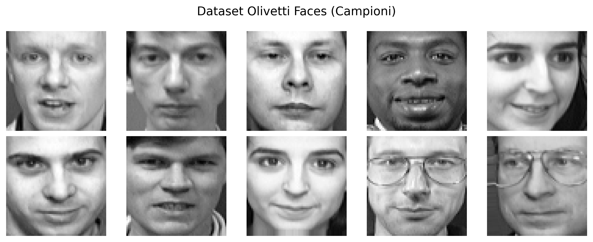
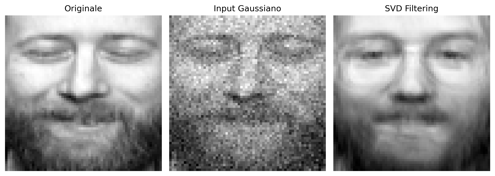
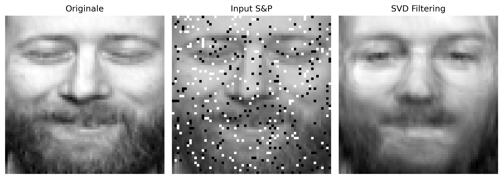
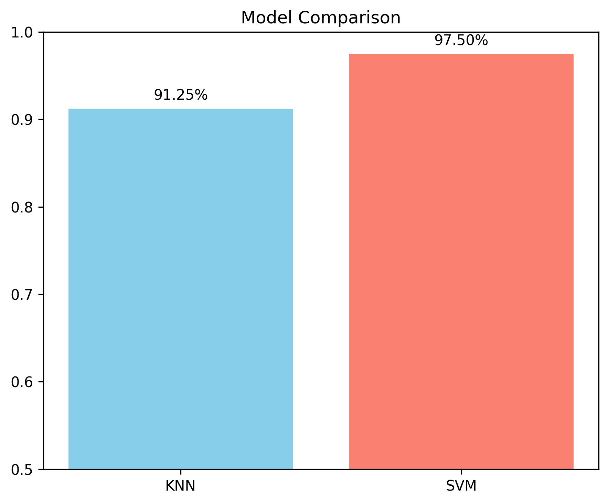

# 🎭 Spectral and Geometric Analysis for Face Recognition

A complete Machine Learning pipeline demonstrating the effectiveness of Singular Value Decomposition (SVD) and Principal Component Analysis (PCA) for feature extraction, dimensionality reduction, and image denoising in facial recognition tasks.

This project compares topological approaches (k-NN) with geometric approaches (SVM) in the latent space of *Eigenfaces*, using the Olivetti Faces dataset.

**Dataset Preview:**


## 🛠️ Tech Stack
* **Language:** Python
* **Machine Learning:** Scikit-Learn (PCA, SVM, KNN, GridSearchCV, Pipelines)
* **Data Handling & Math:** NumPy
* **Visualization:** Matplotlib, Seaborn

## 📂 Project Architecture
* `src/face_recognition_pipeline.py`: The main script containing the end-to-end data science pipeline.
* `output/`: Auto-generated directory containing all exported visual plots and analyses.
* `docs/`: Contains the project presentation with theoretical background and mathematical proofs.

## 🚀 Pipeline Features
1. **Dimensionality Reduction (Eigenfaces):** * Extracted the top Principal Components using Randomized SVD.
   * Reduced the feature space from 4096 to 62 dimensions while retaining 90% of the statistical variance.
2. **Model Selection & Hyperparameter Tuning:**
   * Built scikit-learn `Pipeline` objects to prevent data leakage.
   * Conducted rigorous `GridSearchCV` with Stratified K-Fold Cross-Validation to optimize KNN and SVM classifiers.
3. **Robustness & Noise Injection Analysis:**
   * Tested model resilience by injecting controlled stochastic noise (Gaussian and Salt & Pepper) into the test set.
4. **SVD Filtering & Denoising:**
   * Demonstrated the low-pass filtering properties of SVD by projecting noisy images into the latent space and reconstructing them, successfully recovering facial features.

### 🖼️ Visual Results: SVD Denoising
**Gaussian Noise Filtering**
*(Left: Original | Center: Gaussian Noise | Right: SVD Filtering)*


**Salt & Pepper Noise Filtering**
*(Left: Original | Center: Salt & Pepper Noise | Right: SVD Filtering)*


## 📊 Key Results
* **Accuracy:** The Support Vector Machine (Linear Kernel) outperformed other models, achieving an accuracy of **97.50%** on the test set.
* **Resilience:** The system maintained high performance (>95%) even in the presence of strong noise, proving that linear separability in the latent space is highly robust.

### 📈 Model Comparison

*Performance comparison between topological (k-NN) and geometric (SVM) approaches under varying conditions.*

## 🏁 How to Run
1. Ensure you have Python installed along with the required libraries (`scikit-learn`, `numpy`, `matplotlib`, `seaborn`).
2. Run the pipeline:
   ```bash
   python src/face_recognition_pipeline.py
   ```
